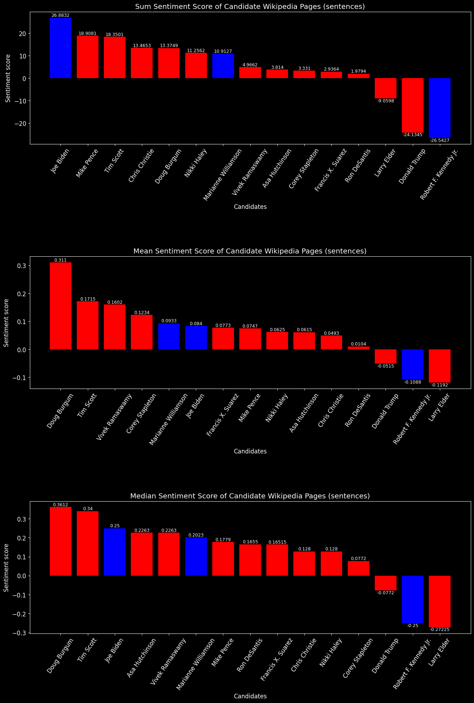
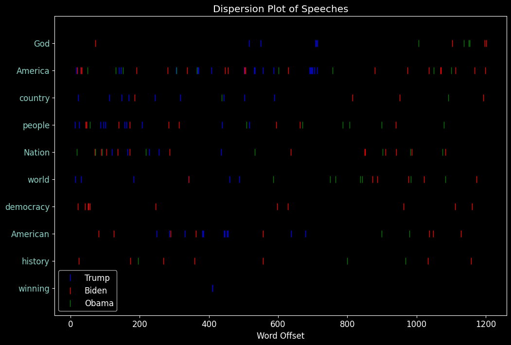

Demonstration of NLP using the Python package NLTK. Scrapes articles from Wikipedia and assigns sentiment using nltk.sentiment.vader SentimentIntensityAnalyzer. This is done for all the declared 2024 presidential candidates, and then the results are graphed and color-coded according to party affiliation.

This model assigns a sentiment to each individual word, out of context from the words around it, between -1 and 1. Different aggregates of those results are then plotted. Further analysis will involve taking the sentiment of sentences and paragraphs as a whole, which allows the model to have more context of the words. However, for this simple demonstration, it only sees and responds to one word at a time.

The default NLTK stop words list had to be expanded to include common words on political pages like "party" and "united," which skew sentiment in the positive direction.

The difference in results between the sum, mean, and median graphs is subtle but worthwhile. Candidates with much longer articles obviously have a higher chance of having their sum score skewed in one way or another if the sentiment is consistent throughout the article. The median could be the most valuable metric to compare candidates because there are no large outliers, and the scale is more easily digestible for humans.

# Individual word sentiment analysis

# Sentence sentiment analysis

In conclusion, I don't think this tells you anything you don't already know or at least don't already have an instinct towards. At the very least, it is an interesting exercise in perhaps uncovering minor biases in these articles between the lesser-known candidates.

This is a dispersion graph of common words used at the inugural addresses of the last 3 presidents.

# 

The similarity of Obama's and Biden's address is interesting. They are approximatly the same length and have a similar distrobustion of key words. Trump's speech is much shorter, and invokes these buzzwords much more frequently. Biden is the only one who used the word "democracy" and he used it 11 times and 5 times in the first 56 notable (excluding stops) words.  

